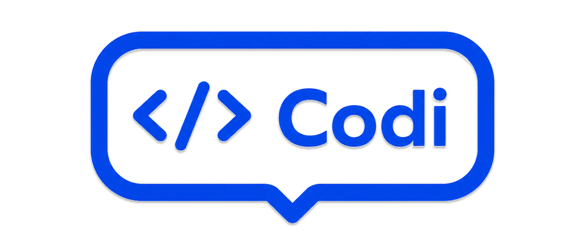

<div align="center">



**AI-Powered PR Review & Deploy Pipeline**

GitHub PR이 열리면 AI 코드리뷰 + E2E 테스트를 자동 실행하고,  
결과를 Slack/Discord로 알림한 뒤 조건 충족 시 **관리자 승인을 거쳐 배포**까지 이어주는 개발 워크플로우 자동화 플랫폼.

[](LICENSE)
[](https://kotlinlang.org)
[](https://spring.io)
[](https://react.dev)

</div>

---

## What is Codi?

Codi는 PR 한 번으로 코드리뷰 · 테스트 · 배포를 자동화하는 오픈소스 플랫폼이다.

- **AI 코드리뷰** — Claude / GPT-4o / Gemini 중 하나를 골라 PR diff를 분석하고 심각도별 이슈를 PR 댓글로 등록
- **자동 E2E 테스트** — Playwright 전용 컨테이너를 파이프라인에서 직접 호출
- **배포 승인 게이트** — HIGH 이슈 0건 + 테스트 통과 시 `DEPLOY_CANDIDATE`로 표시 → **관리자(ADMIN) 승인 클릭 시에만** GitHub Actions 배포 트리거 _(자동 배포 아님)_
- **레포 보안 게이트** — 대시보드에 **등록된 활성 레포의 PR만** 처리 (미등록/비활성 = 202 무시)
- **알림** — Slack + Discord 로 리뷰 완료 · 테스트 결과 · 배포 후보/성공을 단계별 발송
- **RBAC + 감사 로그** — ADMIN 권한 강제 + 로그인·커넥터 변경·배포 승인·레포 등록을 `audit_logs`에 기록
- **MCP 서버** — Claude Desktop · Cursor에서 직접 도구 호출 가능
- **런타임 엔진 교체** — 재배포 없이 대시보드 커넥터 탭에서 AI 엔진 / 알림 채널을 즉시 전환 (키는 마스킹 표시)
- **관리자 패널** — ADMIN 계정으로 시스템 통계 · 시간별 파이프라인 추이 · 행위/감사 이력 모니터링

---

## How It Works

```
GitHub PR 오픈
  │
  ▼  POST /webhook/github  (HMAC-SHA256 검증)
  │
  ▼  보안 게이트: 등록된 활성 레포인가?  (아니면 202 무시)
  │
  ├── AI 코드리뷰  → PR 댓글 등록 → Slack/Discord 알림
  │
  └── Playwright E2E  → 결과 기록 → Slack/Discord 알림
  │
  ▼  HIGH 이슈 0건 + 테스트 통과?
     → 상태 = DEPLOY_CANDIDATE + Slack 승인 요청
  │
  ▼  대시보드에서 ADMIN [배포 승인] 클릭
     → (재검증) → GitHub Actions workflow_dispatch 트리거 → audit_logs 기록
```

---

## Tech Stack

|              |                                                                |
| ------------ | -------------------------------------------------------------- |
| **Backend**  | Kotlin · Spring Boot WebFlux · Coroutines                      |
| **Frontend** | React 18 · Vite · TailwindCSS                                  |
| **Database** | PostgreSQL · Redis (Stream / Cache)                            |
| **AI**       | Claude (Haiku) · GPT-4o Mini · Gemini 2.0 Flash                |
| **Testing**  | Playwright (전용 Node.js 컨테이너, 버전 `1.44.0` 고정)         |
| **MCP**      | Spring AI 1.0.9 (SSE 전송)                                     |
| **Security** | JWT · RBAC · HMAC-SHA256 · AES-256 · Caddy TLS                 |
| **Infra**    | Docker Compose · Caddy · GitHub Actions · Prometheus + Grafana |

---

## Quick Start

### 1. 환경 변수 설정

```bash
cp .env.example .env
```

전체 변수 목록은 [Environment Variables](#environment-variables) 참고.

### 2. 실행

```bash
docker compose up -d
```

### 3. 레포 등록 (보안 게이트)

대시보드 **설정 → 레포지토리 관리(SET002)** 에서 `owner/repo`를 먼저 등록한다.  
등록되지 않았거나 비활성인 레포의 Webhook은 `202`로 무시된다.

### 4. GitHub Webhook 등록

레포 등록 시 발급되는 Payload URL / Secret 을 GitHub `Settings → Webhooks`에 붙여넣는다.

| 항목         | 값                                            |
| ------------ | --------------------------------------------- |
| Payload URL  | `WEBHOOK_CALLBACK_URL` (공개 주소, 예: ngrok) |
| Content type | `application/json`                            |
| Secret       | `.env`의 `WEBHOOK_SECRET`                     |
| Events       | `Pull requests`                               |

> 원클릭 자동 연결(GitHub App)은 V2 예정. V1은 수동 등록 + URL 안내 방식이다.

### 5. 대시보드 접속

```
http://localhost:3000        # 프론트(개발 시 vite dev 는 :5173)
```

Swagger UI: `http://localhost:8080/swagger-ui.html`  
HTTPS(로컬 데모, Caddy): `https://localhost:8443`

---

## Environment Variables

```env
WEBHOOK_SECRET=your_github_webhook_secret
JWT_SECRET=your_jwt_secret_256bit
AES_SECRET_KEY=your_32byte_hex_key

# AI 엔진 (1개 이상)
CLAUDE_API_KEY=sk-ant-...
OPENAI_API_KEY=sk-...
GEMINI_API_KEY=AIza...

# 알림 / VCS
SLACK_WEBHOOK_URL=https://hooks.slack.com/services/...
DISCORD_WEBHOOK_URL=https://discord.com/api/webhooks/...
GITHUB_TOKEN=ghp_...

# 레포 등록 시 대시보드가 발급할 공개 Webhook 주소 (GitHub 이 도달 가능해야 함)
WEBHOOK_CALLBACK_URL=https://{공개주소}/webhook/github
```

> **설정 경계(§8-4)**: `.env`에는 **인프라/부팅 시크릿**(WEBHOOK_SECRET·JWT_SECRET·AES_SECRET_KEY·DB)만 둔다.  
> AI 키·Slack/Discord URL 같은 **런타임 커넥터 값**은 대시보드 커넥터 탭에서 입력 → DB에 AES-256 암호화 저장이 권장 경로다. (`.env`의 AI 키는 편의용 시드)

| 변수                   | 필수 | 설명                                                                                  |
| ---------------------- | ---- | ------------------------------------------------------------------------------------- |
| `WEBHOOK_SECRET`       | ✅   | GitHub Webhook HMAC 서명 키                                                           |
| `JWT_SECRET`           | ✅   | JWT 서명 키 (256비트 이상)                                                            |
| `AES_SECRET_KEY`       | ✅   | 커넥터 API 키 암호화 키 (32바이트 hex)                                                |
| `CLAUDE_API_KEY`       | —    | Anthropic API 키                                                                      |
| `OPENAI_API_KEY`       | —    | OpenAI API 키                                                                         |
| `GEMINI_API_KEY`       | —    | Google Gemini API 키                                                                  |
| `GEMINI_MODEL`         | —    | 기본값 `gemini-2.0-flash`. 무료 쿼터 소진 시 다른 모델(예: `gemini-2.5-flash`)로 교체 |
| `SLACK_WEBHOOK_URL`    | —    | Slack Incoming Webhook URL                                                            |
| `DISCORD_WEBHOOK_URL`  | —    | Discord Incoming Webhook URL (2번째 알림 채널)                                        |
| `GITHUB_TOKEN`         | —    | PR 댓글 · Actions 배포 트리거용 토큰                                                  |
| `WEBHOOK_CALLBACK_URL` | —    | 대시보드가 발급하는 공개 Webhook URL                                                  |
| `PLAYWRIGHT_ENABLED`   | —    | `true` 시 실제 E2E 테스트 실행 (기본값: `false`)                                      |
| `CODEAI_API_KEY`       | —    | MCP 엔드포인트 인증 키 (`X-Api-Key`)                                                  |

---

## Extending Codi

Codi는 5개 SPI 인터페이스로 모든 외부 연동을 추상화한다.  
새 구현체를 Spring Bean으로 등록하면 대시보드에서 즉시 선택할 수 있다.

### 새 AI 엔진 추가

```kotlin
@Component
class MyAiEngine : AIReviewEngine {
    override val id = "my-engine"
    override val preferredPromptVersion = "v4"

    override suspend fun review(diff: String, promptVersion: String): ReviewResult {
        // AI API 호출 후 ReviewResult 반환
    }
}
```

등록 후 `PUT /api/connectors/ai` → `{ "activeProviders": ["my-engine"] }` 로 즉시 전환.

### 새 알림 채널 추가

```kotlin
@Component
class DiscordChannel(
    private val client: DiscordWebhookClient,
) : NotificationChannel {
    override val id = "discord"

    override suspend fun send(payload: Map<String, Any>, webhookUrl: String): Boolean =
        client.send(payload, webhookUrl)   // V1에 실제 구현됨 (2번째 채널)
}
```

### 확장 가능한 SPI 목록

| SPI                   | V1 구현체                                                | 확장 예시              |
| --------------------- | -------------------------------------------------------- | ---------------------- |
| `AIReviewEngine`      | Claude · GPT-4o · Gemini + `suggestFix()` 훅             | Ollama (로컬 LLM)      |
| `VCSProvider`         | GitHub                                                   | GitLab · Bitbucket     |
| `NotificationChannel` | **Slack · Discord**                                      | Teams · PagerDuty      |
| `TestRunner`          | Playwright                                               | Cypress                |
| `DeployProvider`      | GitHub Actions (`mode` PUSH/PULL, `deploy()`+`status()`) | Jenkins · ArgoCD(pull) |

---

## MCP Integration

Claude Desktop · Cursor에서 Codi의 도구를 직접 호출할 수 있다.

`claude_desktop_config.json`:

```json
{
    "mcpServers": {
        "codi": {
            "url": "http://localhost:8080/sse",
            "headers": { "X-Api-Key": "<CODEAI_API_KEY>" }
        }
    }
}
```

사용 가능한 도구: `get_pr_diff` · `post_review_comment` · `run_e2e_tests` · `trigger_deploy` · `send_notification` · `mask_secrets`

---

## Admin Panel

`ADMIN` 역할 전용. 일반 `USER` 계정은 아래 엔드포인트에 `403`.

| 기능               | 엔드포인트                              | 설명                                                                            |
| ------------------ | --------------------------------------- | ------------------------------------------------------------------------------- |
| 시스템 통계        | `GET /api/admin/stats`                  | 총 사용자 수 · 이달 신규 · 활성 파이프라인 · 최근 24h 에러                      |
| 시간별 파이프라인  | `GET /api/admin/pipeline-hourly`        | 오늘 시간대별 실행 수 (0~23시)                                                  |
| 행위 이력          | `GET /api/admin/user-logs`              | 로그인 · 파이프라인 실행 · 설정 변경                                            |
| **감사 로그**      | `GET /api/audit-logs`                   | 보안 감사 (LOGIN · CONNECTOR*UPDATE · DEPLOY_APPROVE · REPO*\* · MCP_TOOL_CALL) |
| **배포 승인**      | `POST /api/pipelines/{id}/deploy`       | `DEPLOY_CANDIDATE` 재검증 후 배포 트리거                                        |
| **레포 등록/토글** | `POST` · `PATCH /api/repositories/{id}` | Webhook URL·Secret 발급 / 활성 토글                                             |
| **커넥터 변경**    | `PUT /api/connectors/{category}`        | AI 엔진 · 알림 채널 교체 (키 AES-256 저장)                                      |

> 최초 관리자: 회원가입 후 DB에서 승격 —  
> `UPDATE users SET role='ADMIN' WHERE email='<your-email>';`

---

## License

## [MIT](LICENSE) © 2026 Team Codi
